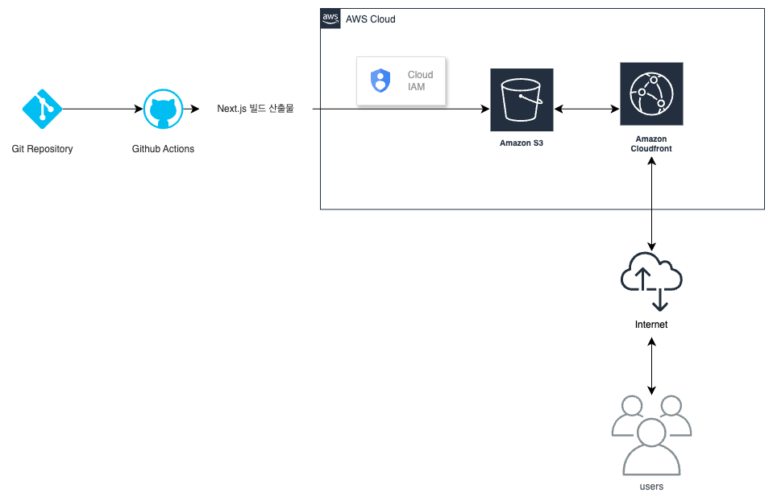

# 프론트엔드 배포 파이프라인

## 개요



- 파일: [deployment.yml](.github/workflows/deployment.yml)
1. 조건: `main` 브랜치에 푸시될 때
2. 실행 환경: Ubuntu
3. Checkout 액션을 사용해 코드 내려받기
4. `npm ci` 명령어로 프로젝트 의존성 설치
5. `npm run build` 명령어로 Next.js 프로젝트 빌드
6. AWS 자격 증명 구성
7. 빌드된 파일을 S3 버킷에 동기화
8. CloudFront 캐시 무효화

## 주요 링크

- S3 버킷 웹사이트 엔드포인트: http://ywkim-hp-s3-1.s3-website.ap-northeast-2.amazonaws.com/
- CloudFront 배포 도메인 이름: https://d17142kvmcza8r.cloudfront.net

## 주요 개념

- GitHub Actions과 CI/CD 도구
  - GitHub Actions
    - 정의: GitHub에서 제공하는 CI/CD 도구
    - 선택 이유: 소규모 프로젝트의 빠른 CI/CD 구축
    - 사용 방법: `.github/workflows` 디렉토리에 YAML 파일 작성
    - 예시
      <details>
        <summary>빌드 및 배포</summary>
        
        ```yaml
        name: Build and Deploy
        on:
          push:
            branches:
              - main
        jobs:
          build:
            runs-on: ubuntu-latest
            steps:
              - name: Checkout
                uses: actions/checkout@v2
              - name: Install Dependencies
                run: npm ci
              - name: Build
                run: npm run build
              - name: Deploy
                run: aws s3 sync ./out s3://your-s3-domain --delete
        ```
      </details>
      <details>
        <summary>테스트</summary>
      
        ```yaml
        name: Test
        on:
          pull_request:
        jobs:
          test:
            runs-on: ubuntu-latest
            steps:
              - name: Checkout
                uses: actions/checkout@v2
              - name: Install Dependencies
                run: npm ci
              - name: Test
                run: npm test
        ```
        </details>
  - CI/CD
    - 정의: 지속적 통합(Continuous Integration)과 지속적 배포(Continuous Deployment)의 약자
    - 선택 이유: 프로젝트의 품질을 유지하고 배포 과정을 자동화
    - 사용 방법: GitHub Actions, Jenkins, Travis CI 등의 도구 사용
- S3와 스토리지
  - S3
    - 정의: AWS에서 제공하는 객체 스토리지 서비스
    - 선택 이유: 정적 파일 호스팅 및 CDN 사용
    - 사용 방법: 버킷 생성, 파일 업로드, 버킷 정책 설정
    - 주요 기능: 버킷 정책, 객체 버전 관리, 객체 복제, 객체 라이프사이클
  - 스토리지
    - 정의: 데이터를 저장하는 장치
    - 선택 이유: 데이터 보관 및 관리
    - 사용 방법: 파일 업로드, 다운로드, 삭제
- CloudFront와 CDN
  - CloudFront
    - 정의: AWS에서 제공하는 CDN 서비스
    - 선택 이유: 정적 파일 캐싱 및 가속화
    - 사용 방법: 배포 생성, 도메인 연결, 캐시 무효화
    - 주요 기능: 캐시 무효화, 로깅, 보안 정책, 압축
  - CDN
    - 정의: 콘텐츠 전송 네트워크(Content Delivery Network)
    - 선택 이유: 콘텐츠 전송 속도 향상
    - 사용 방법: 캐싱, 가속화, 보안
- 캐시 무효화(Cache Invalidation)
  - 정의: 캐시된 데이터를 갱신하는 작업
  - 선택 이유: 새로운 데이터 반영
  - 사용 방법: CloudFront 콘솔에서 무효화 요청
- Repository secret과 환경변수
  - 정의: GitHub 저장소에 저장되는 비밀 정보
  - 선택 이유: 보안 유지
  - 사용 방법: GitHub 저장소 설정에서 추가
- IAM
  - 정의: AWS Identity and Access Management
  - 선택 이유: AWS 리소스에 대한 접근 제어
  - 사용 방법: 사용자 생성, 그룹 생성, 정책 연결
- 자격 증명
  - 정의: AWS 리소스에 대한 접근 권한
  - 선택 이유: AWS 서비스 사용
  - 사용 방법: 액세스 키, 비밀 키 발급
  - 주의 사항: 보안 유지, 노출 방지
## CDN과 성능최적화
### AS-IS
단일 서버에서 정적 파일을 제공하여 대한민국으로부터 멀리 접속하는 사용자일 수록 느린 속도를 경험할 수 있습니다.
### TO-BE
AWS의 CloudFront를 사용하여 정적 파일을 캐싱하고 가속화하여 사용자에게 빠른 속도를 제공합니다.
- Why: 사용자가 어디에 있든지 빠르고 동일한 속도의 서비스를 제공하기 위해
- How:
  - CloudFront 배포 생성
  - 정적 자산 배포
  - 도메인 연결
  - 캐시 무효화
- Result:
  - 평균 페이지 로드 시간 60~80% 감소
- 서버 트래픽 30~80% 감소
**(좌측: CloudFront 사용 후, 우측: CloudFront 사용 전)**

